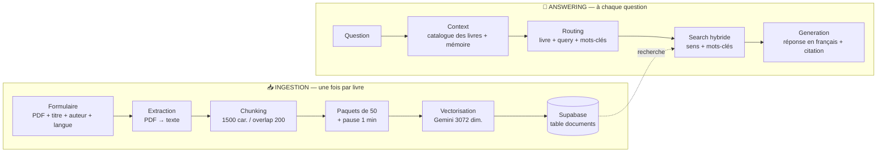

# 📚 Chatbot RAG sur des livres — workflows n8n

Un chatbot qui répond aux questions sur **n'importe quel livre PDF**, en français, en citant le texte du livre et sans rien inventer.
Plusieurs livres peuvent être indexés en même temps (ex. *The Little Prince*, *Theory of Poker*).

**Stack :** n8n · Google Gemini (embeddings + chat) · Supabase (Postgres + pgvector) — 100 % gratuit (quotas gratuits de Gemini et Supabase).

---

## Vue d'ensemble

## Les workflows

| Fichier | Rôle |
|---|---|
| [`RAG Livres - Ingestion & Chat.workflow.ts`](n8n/workflows/RAG%20Livres%20-%20Ingestion%20%26%20Chat.workflow.ts) | **Ingestion** (indexer un livre) + **chatbot** (répondre aux questions) |
| [`RAG Livres - Recherche hybride.workflow.ts`](n8n/workflows/RAG%20Livres%20-%20Recherche%20hybride.workflow.ts) | Sous-workflow utilisé comme **outil `search_book`** par l'agent |

Les workflows sont écrits en TypeScript (`@n8n/workflow-sdk`) et synchronisés avec n8n via `n8ncli` (`pull` / `validate` / `push` / `publish`).
Chaque section du canvas est documentée par une note (sticky note).

---

## 📥 Ingestion

| Nœud | Ce qu'il fait |
|---|---|
| **On form submission** | Formulaire : PDF + **titre**, **auteur**, **langue** du livre |
| **Extract PDF Text** | Extrait le texte brut du PDF |
| **Split into Chunks** | Découpe en passages de ~1500 caractères (overlap 200), en coupant de préférence en fin de phrase ; étiquette chaque passage (`book`, `title`, `author`, `language`, `ingest_id`) |
| **Loop Over Chunks** | Traite les passages **par paquets de 50** |
| **Embeddings Google Gemini (Insert)** | Transforme chaque passage en **vecteur de 3072 nombres** (`gemini-embedding-001`) |
| **Supabase Vector Store** | Enregistre texte + vecteur + métadonnées dans la table `documents` |
| **Wait 1 min** | Pause entre deux paquets : respecte le quota gratuit de Gemini (100 embeddings / minute) |
| **Remove Previous Version** | À la fin, supprime l'ancienne version du même livre → **pas de doublons** (et rien n'est supprimé si l'ingestion échoue) |

## 💬 Answering

| Étape | Nœud(s) | Ce qui se passe |
|---|---|---|
| **Input** | When chat message received | Reçoit la question |
| **Context** | List Books · Simple Memory · consignes | Catalogue des livres (titre, auteur, langue) + 10 derniers messages + règles de réponse |
| **Routing** | AI Agent (Gemini) | Choisit le **livre**, reformule la question (`query`) et extrait des **mots-clés** (`keywords`) dans la langue du livre |
| **Search** | `search_book` → *RAG Livres - Recherche hybride* | Recherche **hybride**, filtrée sur le livre → 5 meilleurs passages |
| **Generation** | AI Agent (Gemini) | Réponse en français, avec citation du livre ; « le livre ne le précise pas » si rien n'est trouvé |

## 🔀 Recherche hybride

`search_book` appelle un sous-workflow : **Embed Question** (vecteur de la question, API Gemini) → **Hybrid Search** (fonction SQL `hybrid_search` dans Supabase) → **Format Passages**.

La fonction `hybrid_search` combine deux recherches puis fusionne leurs classements (*Reciprocal Rank Fusion*) :

| Recherche | Trouve bien | Exemple |
|---|---|---|
| **Par le sens** (vecteurs, pgvector) | les idées, même formulées autrement ou dans une autre langue | « apprivoiser » ↔ *to tame* |
| **Par mots-clés** (plein texte Postgres) | les mots exacts : noms propres, termes rares | *lamplighter*, *Sklansky* |

## 🗄️ Base Supabase

- Table **`documents`** : `content` (texte), `embedding` (`vector(3072)`), `metadata` (livre, titre, auteur, langue…), `fts` (texte indexé pour les mots-clés)
- Fonctions SQL : **`hybrid_search`** (recherche hybride filtrable par livre), **`list_books`** (catalogue), `match_documents` (recherche vectorielle seule)
- Row Level Security activé : seule la clé serveur (`service_role`, utilisée par n8n) accède aux données

## 🔑 Clés API

Toutes les clés (Gemini, Supabase) sont stockées dans les **credentials chiffrés de n8n** et ne figurent **jamais** dans les workflows.
Les nœuds natifs (Gemini, Supabase Vector Store) et les nœuds HTTP Request (embedding de la question, appels SQL) utilisent ces mêmes credentials.

## Choix et limites

- **Quota gratuit Gemini** → envoi par paquets avec pause : un livre de 300 pages (~370 passages) s'indexe en ~8 minutes.
- **Réseau bloquant le port Postgres (5432)** → Supabase est utilisé via son API HTTPS.
- **Pas d'OCR** : un PDF scanné (sans texte sélectionnable) est refusé avec un message clair.
- **Pistes d'amélioration** : augmentation des passages (contexte, questions hypothétiques), **reranking** des passages avant la génération.

## Utilisation

1. **Indexer un livre** : *Execute workflow* → formulaire (PDF, titre, auteur, langue). Renvoyer le même titre remplace l'ancienne version.
2. **Poser une question** dans le chat de n8n, par ex. *« Que fait l'allumeur de réverbères dans Le Petit Prince ? »*
